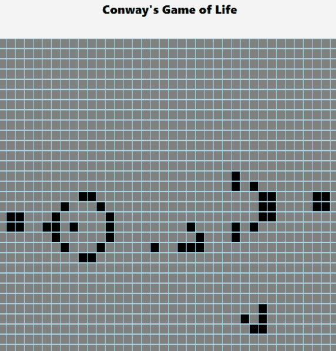
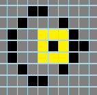

# Conway's Game of Life

Visit the live site [here!](https://seanmackey.me/game_of_life/)

## Description

This app is my implementation of Conway's Game of Life. 

 


'The Game of Life, also known simply as Life, is a cellular automaton devised by the British mathematician John Horton Conway in 1970. It is a zero-player game, meaning that its evolution is determined by its initial state, requiring no further input. One interacts with the Game of Life by creating an initial configuration and observing how it evolves. It is Turing complete and can simulate a universal constructor or any other Turing machine.' -- [Wikipedia](https://en.wikipedia.org/wiki/Conway%27s_Game_of_Life)

The game is played on an infinite two-dimensional grid. The grid is transformed according to these rules:
- Any dead cell with exactly three alive neighbors becomes alive (reproduction)
- Any alive cell with exactly two or three alive neighbors remains alive
- Any alive cell with less than two or more than three alive neighbors becomes dead (underpopulation or overpopulation)

These rules are applied simultaneously to every cell on the grid, dead or alive.
This produces a new grid and the rules are then applied to this new grid, and so on.

## Technologies
- Javascript for the function that transforms the grid and the sample board configurations
- React (implemented only with hooks) for rendering and updating a version of the grid in the browser and creating an interactive UI
- CSS for styling the game for display in the browser

## Features

With this version of Conway's Game of Life, user's can:
- Arrive at an empty grid as a blank slate for their creation
- Click the `Instructions` button to view a pop-up modal outlining the rules and how to use this app
- Follow a link to Wikipedia at the bottom of the instructions to learn about the game in more depth
- Toggle any cells between dead (gray) and alive (black) via mouse click until they have their desired starting configuration
- Alternatively, they can select an existing configuration from the `Favorites` drop down menu and the grid will populate accordingly
- Click `Start` to see the grid transform automatically and continuously
- Click `Next` to move through each transformation at their own pace rather than automatically
- Click `Stop` to pause the automatic transformations
- Click `Reset` to stop the transformations, clear the grid, and return all cells to dead (gray)
- View a 'Generations' counter that keeps track of how many times the grid has transformed

## Coding Challenges 

PROBLEM: The game is played on, and represented on the browser by, a two dimensional grid. However, in the function that applies the game rules and transforms the grid accordingly, I did not want to use a 2-D array as the data structure to represent the board. One, using a 2-D array means that every cell coordinate has to be represented as either dead or alive and iterated over. This is especially wasteful if you consider the number of dead cells on the grid that are nowhere near a live cell and have no chance of becoming alive in the transformation. Two, the grid is meant to be infinite but a 2-D array has boundaries. As the configurations approach the edges you could add rows and columns, but this is costly, especially if you reach the top or left of the grid. You would have to use expensive unshift operations to place new rows/columns at the beginning and essentially re-index the entire 2-D array.

SOLUTION: Use an adjacency list (Javascript Object) as the data structure to represent the board in the function that applies the game rules. This object holds only the coordinates of the live cells, because transformations only happen in proximity to live cells. The keys of the object are the indices of the rows and the values are arrays of numbers representing the indices of the columns. For example, the spaceship glider initially looks like this:
```javascript
const glider = {
    0: [],
    1: [1],
    2: [2],
    3: [0, 1, 2],
    4: []
}
```
When the board needs to expand at the edges or certain cells need to die, insertion and removal are at constant time.

PROBLEM: Although the adjacency list is preferred for the transformation function, there were three related challenges for interacting with the browser version of the board. One, the version of the board the user interacts with is a 2-D array and must be converted to an object for transformation. Two, the transformed object must be converted back into a 2-D array so that React can display it on the browser. Three, as the object version of the board transforms (infinitely, as it should) beyond the boundaries of the 2-D array browser version of the board, the live cells must fluidly disappear and reappear on the browser without raising errors. Initially this was breaking because the unbounded object board had rows and columns that did not exist in the bounded 2-D array board.

SOLUTION: To solve these problems, I created algorithms that converted the board from array to object and back. Here is array to object:
```javascript
const convertGrid = (twoD) => {
        const obj = {}
        for (let i=0; i<twoD.length; i++) {
            obj[i] = []
            for (let j=0; j<twoD[i].length; j++) {
                if (twoD[i][j] !== undefined) {
                    obj[i].push(j)
                } 
            }
        }
        return obj
    }
```
When converting the object back to an array, I prevented the algorithm from considering any row or column index that didn't exist in the pre-defined array (which for this app is a 36 x 100 grid): 
```javascript
const convertObject = (object) => {
        const twoD = Array.from(Array(36), () => new Array(100).fill())
        for (let row in object) {
            if (twoD[row]) { // limit to existing rows
            const cols = object[row] 
                if (cols.length) {
                    for (let i=0; i<cols.length; i++) {
                        if (cols[i] <=99) { // limit to existing columns
                            twoD[row][cols[i]] = 1
                        }
                    }
                }
            }
        }
        return twoD
    }
```
This allows the object to transform infinitely but only display cells on the browser that exist within the boundaries of the array being rendered. 

PROBLEM: As noted above, the adjacency list that represents the board only holds coordinates for live cells. The algorithm generates coordinates of the eight neighbors of each live cell. It then counts how many times each neighbor is adjacent to a live cell. Each cell's fate is determined by how many live cells it is a neighbor to. However, while testing the glider gun template I discovered an edge case. If a live cell has no live neighbors (see black cell surrouded by yellow cells in photo below) it should become dead during the board transformation. Since the algorithm only applies the game rules to neighbors of live cells, it will not evaluate a cell that has NO live neighbors. That cell will stay alive even though it should become dead.



SOLUTION: I added a helper function that checks each live cell to see if it has any live neighbors. If it returns false, the live cell is deleted (becomes dead) from the board. If it returns true the algorithm continues to evaluate the neighbors of the live cell as outlined above.
````javascript
    if(!hasNeighbors(inputBoard, i, j)) { // pass the board, row(i), and column(j) to the helper
        outputBoard[row].splice(idx, 1)   // delete that cell if helper return false
    }

    const hasNeighbors = (board, r, c) => { 
    const neighbors = [ // generate coordinates of eight neighbor cells
        [r, c + 1],
        [r, c - 1], 
        [r + 1, c], 
        [r - 1, c], 
        [r + 1, c + 1], 
        [r - 1, c - 1], 
        [r + 1, c - 1], 
        [r - 1, c + 1], 
    ]
    
    for (let neighbor of neighbors) { // check if any neighbor is alive
        const [i, j] = neighbor 
        if (!(i in board)) board[i] = [] // if neighbor row is out of bounds, create it  
        const idx = board[i].indexOf(j) 
        if (board[i][idx] || board[i][idx] === 0) return true // if the coordinate value is truthy/exists or 0 it's a live neighbor  
    }
    return false
}
````

## Future Implementations
- Play music while the transformations are occuring automatically
- Allow users to select their own colors for dead and alive cells

